# HSIsuqs

AML 2022 summer project code, Hyperspectral Image Segmentation Uncertainty Quantification (HSIsuqs).

# Acknowledgments

© 2023. Triad National Security, LLC. All rights reserved.

This program was produced under U.S. Government contract 89233218CNA000001 for Los Alamos
National Laboratory (LANL), which is operated by Triad National Security, LLC for the U.S.
Department of Energy/National Nuclear Security Administration. All rights in the program are
reserved by Triad National Security, LLC, and the U.S. Department of Energy/National Nuclear
Security Administration. The Government is granted for itself and others acting on its behalf a
nonexclusive, paid-up, irrevocable worldwide license in this material to reproduce, prepare
derivative works, distribute copies to the public, perform publicly and display publicly, and to permit
others to do so.


Code for the datasets.py, and util.py was originally adapted and modified the from the [DeepHyperX](https://github.com/nshaud/DeepHyperX/) package.

Nicolas Audebert, Bertrand Le Saux and Sébastien Lefèvre
"Deep Learning for Classification of Hyperspectral Data: A comparative review",
IEEE Geosciences and Remote Sensing Magazine, 2019.

Code for some of the segmentation algorithms (Felzenszwalb, Quickshift, SLIC, and Watershed) use modified code from [skimage](https://scikit-image.org/docs/stable/api/skimage.segmentation.html) to work with more than 3 channels.
The cython code for SLIC was copied an modified from the skimage package so that it can use cosine distance.

The authors acknowledge the Aerospace Corporation for collecting and providing the historical airborne LWIR data from the Los Angeles basin area.

<!-- # TODO

1. Segmentation and Classification Models
    * Modify skimage models to work with multichannels
        * [X] Felzenszwalb
        * [X] Quickshift
        * [X] SLIC
        * [X] Watershed
    * Explore additional models
        * [ ] Multi-scale segmentation
        * [ ] Multi-scale segmentation ++ (region split/merge with UQ optimization)
        * [X] SlURM
        * [X] Hierarchical clustering
    * ~~Super pixel classification methods~~
        * [ ] ~~Wrap DeepHyperX models~~
        * [ ] ~~Create appropriate training/data augmentation loops~~
    * Dimensionality reduction methods
        * [ ] PCA
        * [ ] T-SNE
        * [ ] PHATE
        * [ ] PHATE spatial
2. Segmentation Evaluation Metrics
    * Unsupervised evaluation metrics
        * [x] Zeb
        * [x] Frc (should investigate a non-uniform implementation)
        * [ ] ~~Vcp (will need to figure out texture measures)~~
    * ~~Supervised Evaluation Metrics~~
        * [ ] ~~Pixel Accuracy~~
        * [ ] ~~IoU/MIoU~~
        * [ ] ~~Dice~~
        * [ ] ~~Others from literature~~
3. Uncertainty Quantification
    * ~~Classification Uncertainty~~
        * [ ] ~~Predicted Probability Entropy~~
        * [ ] ~~Ensemble UQ~~
    * Segmentation Unvertainty Quantification
        * [X] Random Radial Inclusion/Exclusion, Inverse SD Q Score, Average Ratio of E/S Q Scores -->


# Examples

The following shows examples on some standard tasks.

## Loading Data
_______________


This is general workflow for loading data to work well with the functions in this package.
First import the `datasets` module to access the functions to load data.
The most common function to use is the `datasets.get_data` function.
This function needs the name of the image/dataset you want to load.
There are 6 easily accessible standard HSI datasets that can be automatically downloaded.
They are IndianPines, Botswana, KSC, PaviaC, PaviaU, and Salinas.

```python
from HSIsuqs import datasets

indianPines = datasets.get_data('IndianPines')
paviaU = datasets.get_data('PaviaU')
```

Other arguments for `get_data` are the `target_folder` (defaults to `./Data`),
this is the folder to download new data to, or to find already downloaded data.
`datasets` is a dictionary to specify how to download the image, and other metadata,
the default will load the dict from `data_raw/datasets.csv` which has info for the 6
standard datasets.
You can specify your own dict if it has the correct keys (see documentation for `get_data`).
`clip_p` specifies the top and bottom percent to clip the values on when standardizing.

<!-- ~~For custom images, you may need to create your own dataset dictionary modeled after the~~
~~dataset dictionary returned from `get_data`.~~
~~At the very least it should have an `img`, `img_rgb`, and `name` keys.~~
~~If you don't know which channels are the rgb channels, you can choose any 3 channels.~~ -->

Support has been added for loading in your own images and data types.
The `get_custom_data` function works by you passing in the filepath to the data you want to load.
You can also specify a custom `load_function` if you're data type is not supported in the `utils.open_file` function.
Note that if you specify a file without an extension, it will assume it is `.hdr` and load it using the
code from the `pyHAT` project.
If the load function also comes with wavelength information, then a false grayscale and rgb image will be made
using the `utils.false_grey_img` function.
The return dictionary contains the raw image, the image with values clipped, the image standardized between 0-1, the rgb and gray images, as well the result from loading the data, and the wavelengths if included, as well as a name.
Here is an example.

```python
from HSIsuqs import datasets

file = 'data/image_folder/'
ds = datasets.get_custom_data(file)
```

## Segmenting Images
____________________

For all of the segmenters in `models.segmenters`, you can pass in the dict returned from
`get_data`, or you can pass in a numpy array where the 3rd axis is the spectral axis.
That is `img[0, 0, :]` should return the spectra for the pixel located at (0, 0).
There are 4 segmenters that originate from the `skimage.segmentation` module, but they have
been wrapped to all share a come interface.
Specifically all segmenters are extensions of a `Segmenter` class.
When you initialize a `Segmenter`, you can save the object to reference what parameters were set,
or you can initialize and call `get_segmentation` right away to just get the segment.

```python
from HSIsuqs import datasets
from HSIsuqs.models.segmenters import Slic, Watershed, Slurm

# loads the indian pines image
indianPines = datasets.get_data('IndianPines')

# initizalize a segmenter object, then get segmentation.
# Recommended for Slurm to save the slurm object (keep the history).
seger = Slurm(indianPines)
seg = seger.get_segmentation()

# Don't need to keep track of seger if you don't want to
seg = Slic(indianPines).get_segmentation()

# can just pass in an image on it's own
img = indianPines['img']
seg = Watershed(img).get_segmentation()
```

## Basic Plotting
__________________

See the More Plotting section for more ways to plot segmentations.
This is the most simple way to plot a segment, use the `plotting.plot_seg` function.
This can create a segmentation, or plot a provided segmentation.
It can also save a plot and auto generate a unique file path.

```python
import matplotlib.pyplot as plt

from HSIsuqs import datasets
from HSIsuqs.models.segmenters import Slic
from HSIsuqs.plotting import plot_seg

# load data
ds = datasets.get_data('IndianPines')
# get segmentation
seg = Slic(ds, n_segments=200, compactness=0.005).get_segmentation()
# plot seg
plot_seg(ds, Slic, seg=seg, alg_args={'n_segments':200, 'compactness':0.005}, save=False)
plt.show()


# to have it create a seg on it's own, create dict of params
alg_args = {'n_segments':200, 'compactness':0.005}
plot_seg(ds, Slic, alg_args=alg_args, save=False)
plt.show()
```


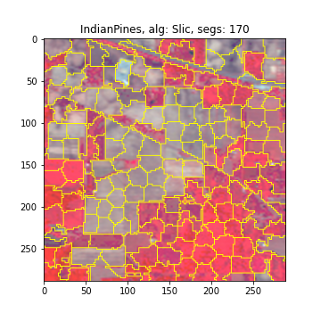

## Felzenszwalb
______________

The Felzenszwalb segmenter appears to be good at finding large homogenous regions such as bodies of water,
but also creates small stringy segments inbetween such large regions.
I have found that setting the `scale` to be between 500-2000 helps reduce oversegmentation,
for larger images use a larger scale if you want to reduce computation time.
It may also help to increase the `sigma` parameter (increase the gaussian blurring in pre-processing),
and to increase the `min_size` parameter (which merges small regions in pos-processing).
This does tend to be a pretty quick segmenter, as long as the scale is high enough.

```python
from HSIsuqs import datasets
from HSIsuqs.models.segmenters import Felzenszwalb
from HSIsuqs.plotting import plot_seg

ds = datasets.get_data('PaviaC')
alg_args = {'scale':2000, 'sigma':1.2, 'min_size':10}
seg = Felzenszwalb(ds, **alg_args).get_segmentation()
plot_seg(ds, Felzenszwalb, alg_args=alg_args, save=False)
```


## Quickshift
_____________

Quickshift appears to be a pretty slow algorithm, so I haven't done much
experimentation with the parameters.

```python
from HSIsuqs import datasets
from HSIsuqs.models.segmenters import Quickshift
from HSIsuqs.plotting import plot_seg

ds = datasets.get_data('IndianPines')
seg = Quickshift(ds).get_segmentation()
plot_seg(ds, Quickshift, save=False)
```

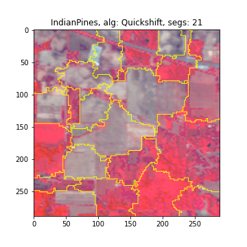


## Slic
_________

Slic is one of my favorite segmentation algorithms.
It creates very gridded segmentations, at is pretty good at finding edges.
I made two implementations, the original uses euclidean distance, mine uses cosine distance.
If using `dist_func='euclid'`, I would recommend starting `compactness` around 1.
If using `dist_func='cos'`, I would recommend starting `compactness` around 0.005.
Using a larger `compactness` will create more square regions, smaller value will create
crazier regions.
Note that `n_segments` is only approximatley the number of segments.

```python
import matplotlib.pyplot as plt

from HSIsuqs import datasets
from HSIsuqs.models.segmenters import Slic
from HSIsuqs.plotting import plot_seg

ds = datasets.get_data('IndianPines')
alg_args = {'n_segments':300, 'dist_func':'cos', 'compactness':0.005}
seg = Slic(ds, **alg_args).get_segmentation()
plot_seg(ds, Slic, alg_args=alg_args, save=False)
plt.show()

alg_args = {'n_segments':300, 'dist_func':'euclid', 'compactness':1}
seg = Slic(ds, **alg_args).get_segmentation()
plot_seg(ds, Slic, alg_args=alg_args, save=False)
plt.show()
```

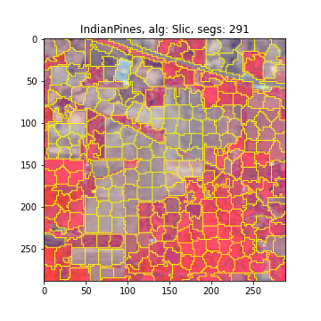
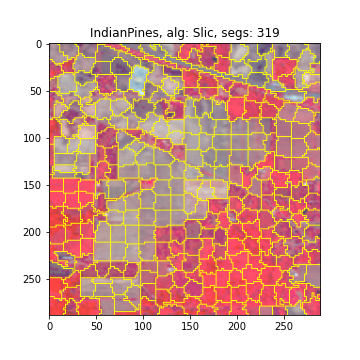


## Watershed
____________

This implementation of Watershed will create an image gradient using the
Robust Color Morphological Gradient.
This is also a somewhat slow algorithm compared to `Slic`.
Also note that if you specify `markers` (the number of segments), it will
randomly place the marker locations.
Thus increasing `markers` will produce chaotic segments because the markers
are being randomly placed every time.

```python
import matplotlib.pyplot as plt

from HSIsuqs import datasets
from HSIsuqs.models.segmenters import Watershed
from HSIsuqs.plotting import plot_seg

ds = datasets.get_data('IndianPines')
alg_args = {'markers': 100}
seg = Watershed(ds, **alg_args).get_segmentation()
plot_seg(ds, Watershed, alg_args=alg_args, save=False)
plt.show()

ds = datasets.get_data('IndianPines')
alg_args = {'markers': 110}
seg = Watershed(ds, **alg_args).get_segmentation()
plot_seg(ds, Watershed, alg_args=alg_args, save=False)
plt.show()
```

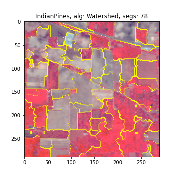


## SlURM
________

This is a segmentation algorithm I created.
It is based on creating an oversegmentation from Slic, and then merging
regions based on Segment Uncertainty Quantification (SUQ score).
This is a slow algorithm, and can be difficult to tune given the number of parameters.

```python
import matplotlib.pyplot as plt

from HSIsuqs import datasets
from HSIsuqs.models.segmenters import Slurm
from HSIsuqs.plotting import plot_seg

ds = datasets.get_data('salinas')

# This will take about 15 minutes to run
obj = Slurm(salinas, iters=10, n_thread=36, seger_args={'compactness':.005, 'dist_func':'cos'},
            min_size=100, uq_args={'n':1, 'p':1, 'r':1, 'min_pixels':4},
            scale_r_with_iters=True, merge_order='mixed', high_percentile=50, max_per_dec=.2)
seg = obj.get_segmentation()

plot_seg(salinas, Slurm, seg=obj.segs[0], save=False)
plt.show()
plot_seg(salinas, Slurm, seg=obj.segs[4], save=False)
plt.show()
plot_seg(salinas, Slurm, seg=obj.segs[-1], save=False)
plt.show()
```


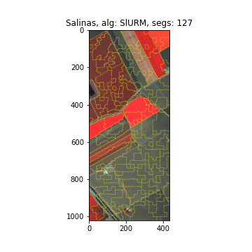


To create plots of each iteration of `Slurm`, you can do something like the following.
This will show the segment, and the SUQ scores at each iteration.
See the More Plotting section for a gif of these plots.

```python
import matplotlib.pyplot as plt

from HSIsuqs import datasets
from HSIsuqs.models.segmenters import Slurm
from HSIsuqs.plotting import plot_SUQ

ds = datasets.get_data('salinas')
obj = Slurm(salinas)
seg = obj.get_segmentation()

for i in range(len(obj.segs)):
    plot_SUQ(ds, Slurm, 'iters', i, seg=obj.segs[i], uq=obj.uqs[i][1],
             save=False, vmax=1.4, vmin=0)
    plt.show()
```


## Segmentation Uncertainty Quantification
_________________________________________

Segmentation Uncertainty Quantification (SUQ score) is a way to measure the uncertainty
about a region and it's boundary.
It can be summarized as "see how a quality score changes as the region changes. If the
quality changes a lot, then there is low uncertainty; if the quality changes a little, then
there is high uncertainty".
This is a general score which can have many different implementations.
Here we implent it with the following specifications:
    1. Quality Score: inverse standard deviation.
    2. Boundary Perturbation: Random Radial Inclusion/Exclusion
    3. Quantification Equation: Average Ratio of E/S Region Q Scores.
See the documentation for `uq.suqs.suqsES` on the implementation and details for this SUQ score.

Using `uq.suqs.suqsES`, you can estimate the uncertainty for a certain region, all regions in a segmentation,
get the quality score for a region, and get the UQ or Q score if two (or more) regions are merged.
There is also an accompanying plotting function `plotting.plot_SUQ` to help visualize the SUQ scores for a region.
Here is a basic example of finding the SUQ scores.

```python
from HSIsuqs import datasets
from HSIsuqs.models.segmenters import Slic
from HSIsuqs.plotting import plot_SUQ
from HSIsuqs.uq.suqs import suqsES

# first create a segmentation
ds = datasets.get_data('indianPines')
seg = Slic(ds, n_segments=350).get_segmentation()

# gets a list of SUQ score and dict of SUQ scores
uq_l, uq_d = suqsES(ds, seg).get_uq()
plot_SUQ(ds, Slic, seg=seg, uq=uq_d, save=False)
```

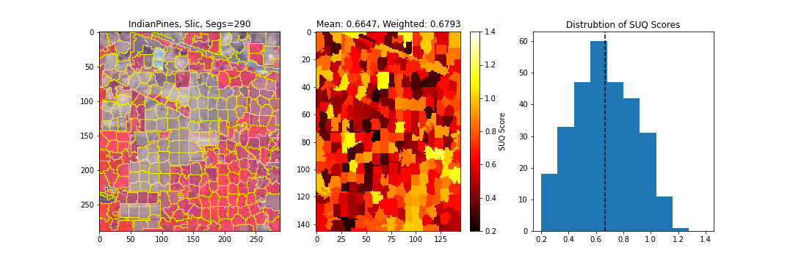

You can also get single region SUQ or Q scores, as well what the SUQ and Q score would be if multiple regions were merged.

```python
# Get SUQ for all regions
suq = suqsES(ds, seg)
uq_l, uq_d = suq.get_uq()

# Get SUQ for region 1
uq_1 = suq.get_uq_reg(1)
# Get SUQ for region 1 and 2 as if they were the same region
uq_1and2 = suq.get_uq_reg(1, 2)

# Similarly if you just want the Q scores
q_1 = suq.get_q_score_reg(1)
q_1and2 = suq.get_q_score_reg(1, 2)
```

You can also get the simulated enlarged/shrunken/original boundaries, along with the enlarged/shrunken/original Q scores, and the overall SUQ score using `get_e_s_boundaries`.
There is also a plotting function to show these regions.

```python
# get all of the values for finding the SUQ score,
# where enlarged, shrunken, and original are boolean arrays,
# Q_e, Q_s, Q_o are the quality scores respectively, and uq is the final score.
enlarged, shrunken, original, Q_e, Q_s, Q_o, uq = suq.get_e_s_boundaries(1)

# To plot use this
from HSIsuqs.plotting import plot_individual_SUQ
plot_individual_SUQ(ds, seg, 215, save=False, uq_args={'r':2, 'p':.65}, seed=420)
```

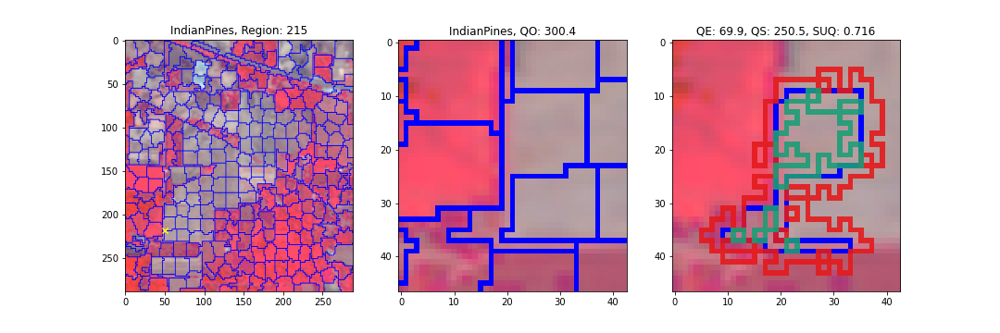

## Image Whitening, ROIs, and Model Inference
_____________________________________________

One of the purposes of this package is to help investigate how image segmentation can be used to help in gas plume detection in HSI.
A specific area to try to improve is in the whitening of spectra before classification.
Currently, it is common to use all the spectra in an image to estimate a covariance matrix, and a mean spectra, so that the image can
be whitened by doing $C^{-1/2}(x-\bar{x})$ for all pixels $x$ in the image.
A potentially better approach is to whiten pixels locally instead of globablly.
Here we use a segmentation of an image to define the regions to locally find a covariance matrix and mean spectra, and to whiten pixels
inside the segment using that local covariance and mean spectra.

First, to find the globally whitened version of an image, you can do the following.

```python
from HSIsuqs.datasets import get_custom_data
from HSIsuqs.whitening import whiten_img

file = 'data/image_folder'
ds = get_custom_data(file)

# isr_cov is the inverse square root of the covariance matrix
img_all, means, isr_cov = whiten_img(ds['img_raw'])
```

To do local whitening, you specify a segmentation map to use, and what segments to whiten.
The default is to whiten all pixels in the image; you can also specify a x and y max and min values to only whiten a certain section of the image.
In this implementation, there is an `r` parameter, which specifies how many additional boundary layers should be included in the calculation of the covariance and mean.
Including extra pixels helps create a more stable covariance estimate.
You can let `r=None`, which will make it so that each region will keep including boundary layers untill it has at least as many pixels as there are spectral channels.
In conjunction with `r=None` you can specify `min_r` which will be the number of boundary layers to included before checking if there are enough pixels.
The default is to have `r=None` and `min_r=3`
The command is the same as above, but now you need a segmentation.

```python
from HSIsuqs.models.segmenters import Watershed
from HSIsuqs.plotting import plot_seg_spectra
from matplotlib import pyplot as plt

seg_water = Watershed(ds, markers=300).get_segmentation()
img_water, means, isr_cov = whiten_img(ds['img_raw'], seg=seg_water)

# Can use seg spectra to see the difference between the original and whitened spectra
plot_seg_spectra(ds, Watershed, seg=seg_water, fig_size=(20, 2), rotation=-90, top_to_bottom=True, name='Original Spectra')
plt.show()

y=.75
plot_seg_spectra(img_water, Watershed, rgb_img=ds['img_rgb'], seg=seg_water, fig_size=(20, 2), rotation=-90,
                 top_to_bottom=True, y_min=-y, y_max=y, name='Locally Whitened Spectra')
plt.show()
```


To load in a region of interest from a JSON file (formatted like what is used with DeepHAT), simply use `get_roi`.
You have to specify the image you want the pixels to be extracted from, and an rgb image which is used to create
an image with the ROI pixels in red.
In `plot_seg_spectra`, we set the img to be either the raw image, or the whitened image.
For the rgb imgage, we use `RGB_MASK` image from the roi dict because it will have the ROI pixels in red.
And for the segmentation, we use the `IMG_MASK` from the roi dict which will be true where the ROI pixels are.
Note that the images are on different y scales.

```python
from HSIsuqs.utils import get_roi

roi_file = 'data/roi_info/roi.json'
res = get_roi(roi_file, ds['img_raw'], ds['img_rgb'])

for k in res.keys():
    # Shows what the ROI spectra look like originally
    plot_seg_spectra(ds['img_raw'], None, rgb_img=res[k]['RGB_MASK'], seg=res[k]['IMG_MASK'], fig_size=(20, 2),
                     rotation=-90, alg_name=k, top_to_bottom=True, bound_args={'mode': 'thick'}, cmap_='copper',
                     y_min=0, y_max=1)
    plt.show()
    # Shows what the ROI spectra look like whitened
    y = 2.5
    plot_seg_spectra(img_water, None, rgb_img=res[k]['RGB_MASK'], seg=res[k]['IMG_MASK'], fig_size=(20, 2),
                     rotation=-90, alg_name=k, top_to_bottom=True, bound_args={'mode': 'thick'}, cmap_='copper',
                     y_min=-y, y_max=y)
    plt.show()
```

<!-- 
 -->


<!-- 
 -->

Now that we have a region of interest, and whitened spectra, we can load a classification model to try and classify these regions of interest.
We can load a DeepHAT model using `models.classifiers.TrainedModel`.
Because we have already found whitened data, we can pass it into the model.

```python
from HSIsuqs.models.classifiers import TrainedModel

model_file = 'data/models/my_model.pt'
model = TrainedModel(model_file, roi_file, ds, whiten=img_water)
# n=5 says to print out the top 5 predictions for each ROI
r = model.predict_roi(n=5)

# output looks like:
"""
...

Number of substances for ROI gas_0752 in probability scores: 15693
  ROI ID, Substance Name, Score
	 gas_0752 Acetic acid 1	       0.044508144
	 gas_0752 Jarosite 1	       0.02751269
	 gas_0752 Jarosite 2	       0.01573995
	 gas_0752 fiberglass epoxy 	   0.01401442
	 gas_0752 Acetic acid 2 	   0.012509323

...

"""
```

## More Plotting
________________

The last main plotting function is `plot_seg_spectra`, which allows you to plot each regions average spectra for a segmentation.
This lets you see how different segments capture different information.
It should be noted that this is prone to being a very busy plot with lots of overplotting if the given segment has many regions.
But that is unavoidable for large images with many segments.
Here is an example.

```python
from HSIsuqs import datasets
from HSIsuqs.models.segmenters import Slic
from HSIsuqs.plotting import plot_seg_spectra

ds = datasets.get_data('paviaC')
seg = Slic(ds, n_segments=1000).get_segmentation()
plot_seg_spectra(ds, Slic, seg=seg, save=False, line_alpha=.6)
```

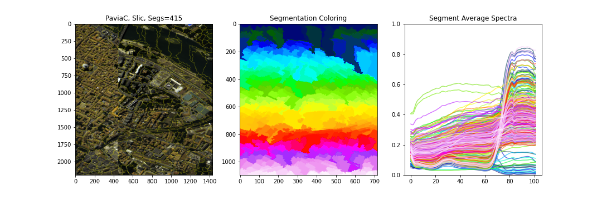


If the image you are working with is a strange dimension (say very long and thin), then there are some plotting options to help format it to look better.
Here is what the default plot will look like for this long image.

```python
from HSIsuqs import datasets
from HSIsuqs.models.segmenters import Slic
from HSIsuqs.plotting import plot_seg

file = 'data/image_folder/'
ds = datasets.get_custom_data(file)
seg = Slic(ds, n_segments=2000).get_segmentation()
plot_seg(ds, Slic, seg=seg)
```

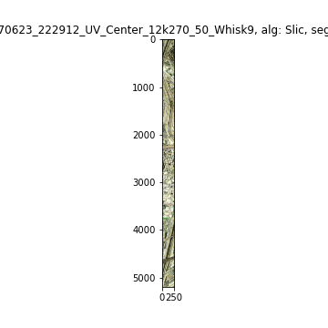

To fix this we change a couple of things.
First we set `bound_args={'mode': 'thick'}` which will make the segment boarders more visible.
Then we rotate the image by 90 degrees so that it plots long ways using `rotation=90`.
Lastly we increase the figure size by `fig_size=(15, 2)`, which will make the image 30 inches wide, and 5 inches tall.
You'll have to play around with the `fig_size` to get something you want.
This makes it much easier to see.

```python
plot_seg(ds, Slic, seg=seg, bound_args={'mode':'thick'}, fig_size=(15, 2), rotation=90)
```


You will want to make similar changes when making a plot with subplots, such as when plotting SUQ.
Here we also use `top_to_bottom` to make the plots stack on top of each other instead of being side by side.
We also use `colorbar=False` so that the colored image matches the dimensions of the segmentation image.

```python
from HSIsuqs.uq.suqs import suqsES
from HSIsuqs.plotting import plot_SUQ
uq_l, uq_d = suqsES(ds, seg, n=10, p=.65, r=2).get_uq()
plot_SUQ(ds, Slic, seg=seg, uq=uq_d, rotation=90, top_to_bottom=True, fig_size=(30, 3.5),
         colorbar=False, bound_args={'mode': 'thick'})
```

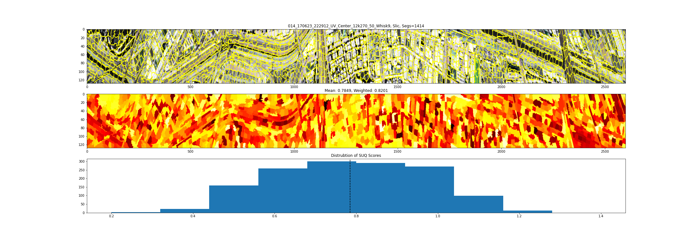

Lastly we do the same thing for plotting the spectra averages.
Note that with long images, it will simply be difficult to make good looking plots.

```python
from HSIsuqs.plotting import plot_seg_spectra
plot_seg_spectra(ds, Slic, seg=seg, rotation=90, top_to_bottom=True, fig_size=(30, 3.5),
                 bound_args={'mode':'thick'}, line_alpha=.5)
```

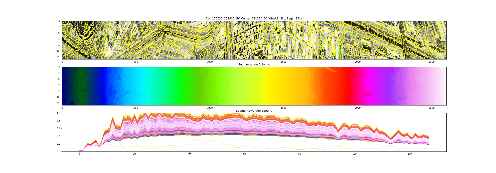


## Making Gifs
______________

We have functions to make individual plots of segmentations, segmentation spectra, SUQ scores, and individual SUQ regions.
It can be useful to see how these plots change as certain parameters for a segmentation model changes.
To help visualize this, it is helpful to create a gif of the same plot as these values change.
We will start with an example of making a gif a Slic segmentations as the compactness parameter changes.
Note that all of the plotting functions have the ability to automatically generate a directory/filename to save the images (in such as a way that making gifs should be easy), but it might be easier to save the files yourself in the for loop that generates the plots.

Here is an example of plotting the Slic algorithm over different values of compactness on Indian Pines.
We use the plotting functions file saving to save the plots for us.

```python
from tqdm.notebook import tqdm

from HSIsuqs import datasets
from HSIsuqs.models.segmenters import Slic
from HSIsuqs.plotting import plot_seg

ds = datasets.get_data('IndianPines')

comp_vals = [0.1, 0.05, 0.01, 0.005, 0.001, 0.0005, 0.0001]
segs = []
for c in tqdm(comp_vals):
    seg = Slic(ds, n_segments=400, compactness=c).get_segmentation()
    segs.append(seg)

for s in tqdm(segs):
    plot_seg(ds, Slic, seg=s, folder='./readme_figures/gif_1/', save=True)
```

This will produce figures in the folder `./readme_figures/gif_1/IndianPines/Slic`, where the files are in the format `IndianPines_Slic_00xxx.png` where the xxx is the number of segments in that image.
In order to make these images into a gif, we use the command line tool `convert` from image magick.
The `-delay 100` means have 100 miliseconds per frame, `-dispose Previous` makes the frames not overlap each other, `-reverse` changes the order to go from most segments to least segments, `-loop 0` means to loop forever.
Then you specify the general filepath, where the `*` is a wild card for the number of the plot, and the last file is where you want to save it.

```bash
convert -delay 100 -dispose Previous -reverse -loop 0 readme_figures/gif_1/IndianPines/Slic/IndianPines_Slic_*.png readme_figures/gif_1.gif
```

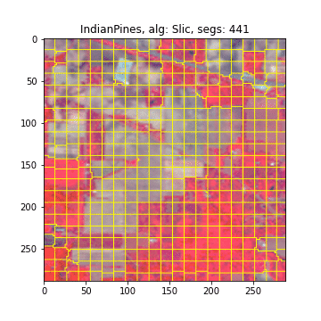


Now here is an example of plotting different SUQ plots from a Slurm segmentation.
This time we will manually save the files to have more control over the save files.
Note that to get files to number in order, it easy to use an `f` string with the file number formated with `{num:06d}`.
This will format so there are 6 total digits with leading zeros.
You can use less than 6 if you want to, just make sure you have at least one leading zero infront of your largest file number.
The file number can be anything, like a parameter used to make the plot, the number of segments in the plot, or just an index from a for loop.
Here we use the index of a for loop to save and number our files.

```python
from HSIsuqs import datasets
from HSIsuqs.models.segmenters import Slurm
from HSIsuqs.plotting import plot_SUQ

# Get Slurm segments
ds = datasets.get_data('IndianPines')
obj = Slurm(ds, iters=10, n_thread=10, seger_args={'compactness':.005, 'dist_func':'cos'}, 
            min_size=20, uq_args={'n':10, 'p':.65, 'r':1}, scale_r_with_iters=True, 
            merge_order='mixed', high_percentile=50, max_per_dec=.2)
seg = obj.get_segmentation()

# Plot all the Slurm segments and SUQ
for i in range(len(obj.segs)):
    plot_SUQ(ds, Slurm, 'iters', i, seg=obj.segs[i], uq=obj.uqs[i][1],
             save=False, vmax=1.2, vmin=0)
    plt.savefig(f'./readme_figures/gif_2/Slurm_{i:03d}')
    plt.show()
```

```bash
convert -delay 100 -dispose Previous -loop 0 readme_figures/gif_2/Slurm_*.png readme_figures/gif_2.gif
```


Lastly, this is how to make a gif for different simulations of a region while calculating the SUQ score.

```python
from HSIsuqs.datasets import get_data
from HSIsuqs.models.segmenters import Slic
from HSIsuqs.plotting import plot_individual_SUQ

ds = get_data('indianPines')
seg = Slic(ds, n_segments=200, compactness=.005).get_segmentation()

# Get example of Low UQ region
for s in range(10):
    plot_individual_SUQ(ds, seg, 130, uq_args={'r':2, 'p':.65}, seed=s, save=True,
                        folder='./readme_figures/gif_3')

# Get example of high UQ region
for s in range(10):
    plot_individual_SUQ(ds, seg, 152, uq_args={'r':2, 'p':.65}, seed=s, save=True,
                        folder='./readme_figures/gif_3')
```


```bash
convert -delay 80 -dispose Previous -loop 0 readme_figures/gif_3/IndianPines/SegSUQ/IndianPines_130_*.png readme_figures/gif_3_low.gif

convert -delay 80 -dispose Previous -loop 0 readme_figures/gif_3/IndianPines/SegSUQ/IndianPines_152_*.png readme_figures/gif_3_high.gif
```

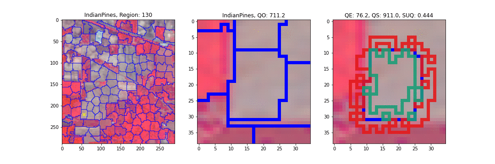
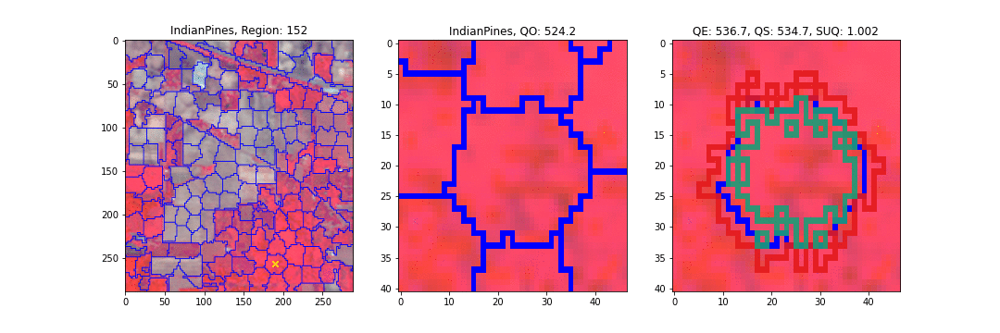
